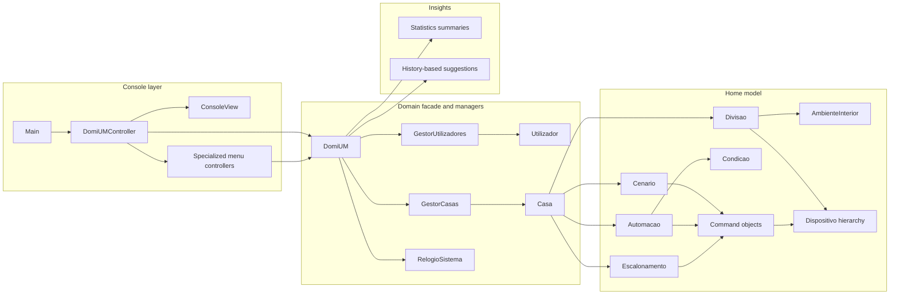

# 🏠 DomiUM - DomusControl

<p align="center">
  
</p>

> A smart-home automation simulator built in Java for the Object-Oriented Programming course, a 2nd-year, 2nd-semester course in the Software Engineering degree.

**DomiUM** is a console-based smart-home management system inspired by platforms such as Home Assistant. It allows users to create homes, rooms and smart devices, assign permissions, operate devices individually, define scenarios, create automations triggered by environmental conditions, schedule actions over simulated time, collect usage statistics, and persist the full application state to disk.

The original assignment statement is available in [`docs/assignment.pdf`](./docs/assignment.pdf).

The project report is available in [`docs/report.pdf`](./docs/report.pdf).

Both documents are written in Portuguese, as this was an academic project developed and evaluated in Portuguese.

---

## ✨ What This Project Demonstrates

This project was designed around object-oriented programming principles, not just around a working menu.

| Area | What was implemented |
|---|---|
| Object-oriented domain model | Users, homes, rooms, devices, permissions, scenarios, automations and schedules |
| Inheritance and polymorphism | A generic `Dispositivo` base class with multiple specialized smart-device classes |
| Extensibility | Device creation through a `DispositivoRegistry` and factory classes, allowing new device types without changing the main domain facade |
| Command pattern | Device actions represented as command objects that can be executed directly or stored inside scenarios, automations and schedules |
| Encapsulation | Domain entities expose controlled APIs and use cloning/copying to avoid leaking mutable internal state |
| Permissions | `ADMIN` and `NORMAL` access levels per home |
| Simulated time | Internal clock used to trigger schedules and accumulate device usage/energy consumption |
| Persistence | Full binary save/load of the application state |
| Suggestions | Automatic schedule suggestions generated from repeated user interactions |
| Validation | Regression tests for permissions, persistence, time, consumption, removals, exceptions and aggregate commands |

---

## 🧠 Core Idea

DomusControl models a smart home as a hierarchy of entities:

```text
User
  └── permissions over homes

Home
  ├── rooms
  │   ├── smart devices
  │   └── environmental state
  ├── scenarios
  ├── automations
  └── schedules
```

Users can interact with devices one by one, or define higher-level behavior:

| Concept | Meaning |
|---|---|
| **Scenario** | A reusable group of commands, such as "Leave Home", "Dinner with Friends" or "Wake Up". |
| **Automation** | A condition-based rule triggered by temperature, humidity or luminosity changes. |
| **Schedule** | A time-based rule with start and end actions, evaluated through the simulated clock. |
| **Suggestion** | A proposed schedule generated from repeated actions in a user's interaction history. |

---

## 🏗️ Architecture



### Class Diagram

The full class diagram is available in [`docs/diagram.pdf`](./docs/diagram.pdf).

<p align="center">
  
</p>

---

## 🔌 Supported Smart Devices

Devices share common attributes such as identifier, brand, model, hourly consumption and on/off state, while each specialized class adds its own behavior.

| Type key | Class | Specific behavior |
|---|---|---|
| `lampada` | `LampadaInteligente` | Turn on/off, set intensity, set color temperature in Kelvin |
| `coluna` | `ColunaInteligente` | Turn on/off, set volume, set current playlist |
| `cortina` | `CortinaInteligente` | Set opening percentage |
| `arcondicionado` | `ArCondicionadoInteligente` | Turn on/off, set target temperature, set operating mode |
| `desumidificador` | `DesumidificadorInteligente` | Turn on/off, set target humidity |
| `portao` | `PortaoGaragemInteligente` | Open and close garage gate |
| `fechadura` | `FechaduraInteligente` | Lock and unlock smart lock |

New device types can be added by creating a new subclass and registering a new factory in the device registry.

---

## 🎛️ Main Features

| Feature | Description |
|---|---|
| User management | Create users and list registered users |
| Home management | Create homes, rooms and assign devices to rooms |
| Permission system | Grant `ADMIN` or `NORMAL` access to users per home |
| Device operations | Execute generic and device-specific commands |
| Environmental state | Update room temperature, humidity and luminosity |
| Scenarios | Store and execute grouped device commands |
| Automations | Trigger actions from room conditions |
| Schedules | Execute start/end actions based on simulated time |
| Statistics | Query energy consumption, most-used devices and rooms with most devices |
| Suggestions | Detect repeated user behavior and suggest schedules |
| Persistence | Save and reload the full application state using binary serialization |

---

## 📁 Project Structure

```text
DomiUM/
├── app/
│   ├── build.gradle
│   └── src/
│       ├── main/java/domus/
│       │   ├── Main.java
│       │   ├── controller/          Console controllers and menu logic
│       │   ├── domain/              Core domain model and application facade
│       │   │   ├── automation/      Condition-based automations
│       │   │   ├── commands/        Device command objects
│       │   │   ├── conditions/      Temperature, humidity and luminosity rules
│       │   │   ├── core/            User, home, room and permission entities
│       │   │   ├── devices/         Smart-device hierarchy
│       │   │   ├── factories/       Device factory registry
│       │   │   ├── history/         User interaction history
│       │   │   ├── managers/        User and home managers
│       │   │   ├── scenarios/       Scenario aggregate
│       │   │   ├── scheduling/      Time-based schedules
│       │   │   ├── statistics/      Statistics result objects
│       │   │   ├── suggestions/     Automatic schedule suggestion logic
│       │   │   └── time/            Simulated system clock
│       │   └── ui/                  Console view
│       └── test/java/domus/domain/  JUnit regression tests
├── docs/
│   ├── assignment.pdf
│   ├── report.pdf
│   ├── diagram.pdf
│   └── diagram.png
├── estados/
│   ├── povoamento-final.bin         Demo state saved from the console app
│   └── povoamento-final.txt         Human-readable description of the demo state
├── gradle/
├── gradlew
├── gradlew.bat
└── settings.gradle
```

---

## ⚙️ Requirements

- Java 17
- Gradle wrapper included in the repository

No system-wide Gradle installation is required.

---

## 🚀 Run

Start the interactive console application:

```bash
./gradlew run
```

The application opens the main menu:

```text
=== DomusControl ===
1. Criar utilizador
2. Listar utilizadores
3. Gerir permissões
4. Criar casa
...
20. Menu de estatísticas
21. Menu de sugestões
22. Guardar estado
23. Carregar estado
24. Consultar data/hora atual
25. Avançar tempo
0. Sair
```

The interface is in Portuguese because the project was developed for a Portuguese course and evaluated through a Portuguese assignment.

---

## 🧪 Tests

Run the complete test suite:

```bash
./gradlew test
```

Build the project and run tests:

```bash
./gradlew build
```

The tests cover:

- user and home creation;
- permission rules between `ADMIN` and `NORMAL` users;
- device creation and command execution;
- scenario, automation and schedule command aggregation;
- simulated time and accumulated energy consumption;
- binary persistence with valid and invalid paths;
- automatic schedule suggestions generated from repeated history;
- removals and error handling for missing entities;
- rejection of incompatible commands, such as setting speaker volume on a lamp.

---

## 🧾 Demo State

A complete saved state is included in:

```text
estados/povoamento-final.bin
```

To load it:

1. Run the app with `./gradlew run`.
2. Choose option `23. Carregar estado`.
3. Enter `estados/povoamento-final.bin`.

The readable companion file [`estados/povoamento-final.txt`](./estados/povoamento-final.txt) describes the demo data and validation steps.

### Demo Data Highlights

| Entity | Amount |
|---|---:|
| Users | 4 |
| Homes | 3 |
| Rooms | 12 |
| Devices | 22 |
| Device types | 7 |
| Scenarios | 6 |
| Schedules | 6 |
| Automations | 5 |
| Accepted suggestions | 1 |

The demo state includes the required scenarios:

| Scenario | Example behavior |
|---|---|
| `cenario-sair` | Turns off lights, speaker and air conditioner |
| `cenario-jantar` | Sets dinner lighting, speaker volume and playlist |
| `cenario-deitar` | Turns off living-room devices, adjusts lighting and closes curtains |
| `cenario-acordar` | Turns on morning devices |

It also includes tested automations such as:

| Automation | Trigger | Action example |
|---|---|---|
| `auto-luz-sala` | Low luminosity in the living room | Turns on a lamp |
| `auto-humidade-cozinha` | High humidity in the kitchen | Turns on the dehumidifier |
| `auto-temp-quarto` | High bedroom temperature | Turns on and configures the air conditioner |
| `auto-ambiente-jantar` | Low luminosity in the living room | Configures lights and speaker for dinner |

---

## 📊 Statistics

The statistics menu can answer questions such as:

| Query | Purpose |
|---|---|
| House with highest consumption | Finds the home with the largest accumulated energy usage |
| Top 3 devices by time on | Ranks devices by total minutes powered on |
| Top 3 devices by activations | Ranks devices by number of times turned on |
| Top 3 rooms with most devices | Finds the most device-dense rooms across all homes |
| Consumption summary | Lists accumulated consumption per home |

The demo state includes final statistics in [`estados/povoamento-final.txt`](./estados/povoamento-final.txt), including the highest-consumption house and the most-used devices.

---

## 🧩 Design Patterns and Decisions

| Decision | Why it matters |
|---|---|
| MVC-inspired structure | The console view does not know the domain model, and the model does not know the view; interaction between both sides is coordinated by the controller layer. |
| `DomiUM` as a facade | Keeps controllers independent from internal manager details |
| Device registry + factories | Supports new smart-device types with minimal changes |
| Command objects | Allows the same operation to be executed directly or stored in scenarios, automations and schedules |
| Separate menu controllers | Keeps the console UI organized by feature area |
| Simulated clock | Makes time-based behavior testable without depending on real time |
| Binary serialization | Allows full state recovery for the project presentation |
| Defensive copying and cloning | Protects internal domain state from accidental external mutation |

---

## 📚 Documentation

| File | Description |
|---|---|
| [`docs/assignment.pdf`](./docs/assignment.pdf) | Original practical assignment statement |
| [`docs/report.pdf`](./docs/report.pdf) | Project report |
| [`docs/diagram.pdf`](./docs/diagram.pdf) | Class diagram |
| [`estados/povoamento-final.txt`](./estados/povoamento-final.txt) | Explanation of the final demo state |

---

## ⚠️ Notes and Limitations

- The application is intentionally console-based; no graphical interface was required by the assignment.
- Menu text and runtime messages are in Portuguese.
- Persistence uses Java binary serialization, so saved states are tied to the Java class structure of this project.
- Environmental sensors are simulated through room state updates rather than real external integrations.
- Suggestions are based on repeated user interactions and currently create schedule suggestions for supported simple actions.

---

## 👥 Authors

| Name | GitHub |
|---|---|
| [Simão Santos](https://github.com/simaosantoss) | `@simaosantoss` |
| [Alexandre Machado](https://github.com/alexgsm022) | `@alexgsm022` |
